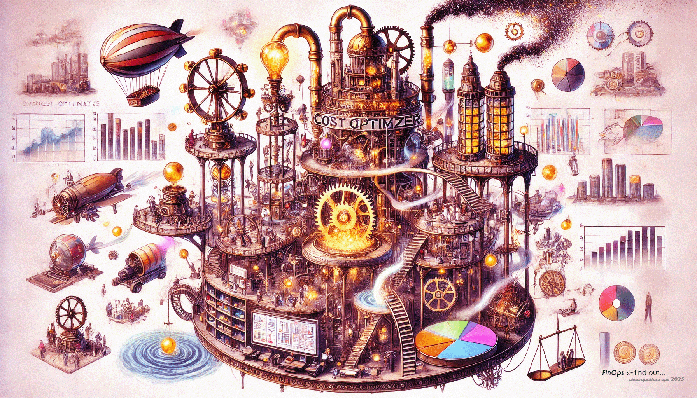

# FinOps and find out...                                
                                
                                
<html>                               
	                                
</html>                                
                              
An indepth exploration of Cost and Usage data across AWS, GCP and Azure.                                 
All data is notional (and generators for the data are included).                                 
                                
We perform all sorts of analysis, including chargeback, showback and others.                                 
We try to build models to forecast costs by projects, services etc.                                
Possibly even try our hand at scenario based analysis too.                              
                                
                    
# Data, Data Dictionaries, Comparisions and Data Generators                    
                      
* [AWS](https://github.com/shauryashaurya/FinOps-and-find-out/tree/main/cost-and-usage-data/aws)                    
* [GCP](https://github.com/shauryashaurya/FinOps-and-find-out/tree/main/cost-and-usage-data/gcp)                    
* [Azure](https://github.com/shauryashaurya/FinOps-and-find-out/tree/main/cost-and-usage-data/azure)          
          
          
.