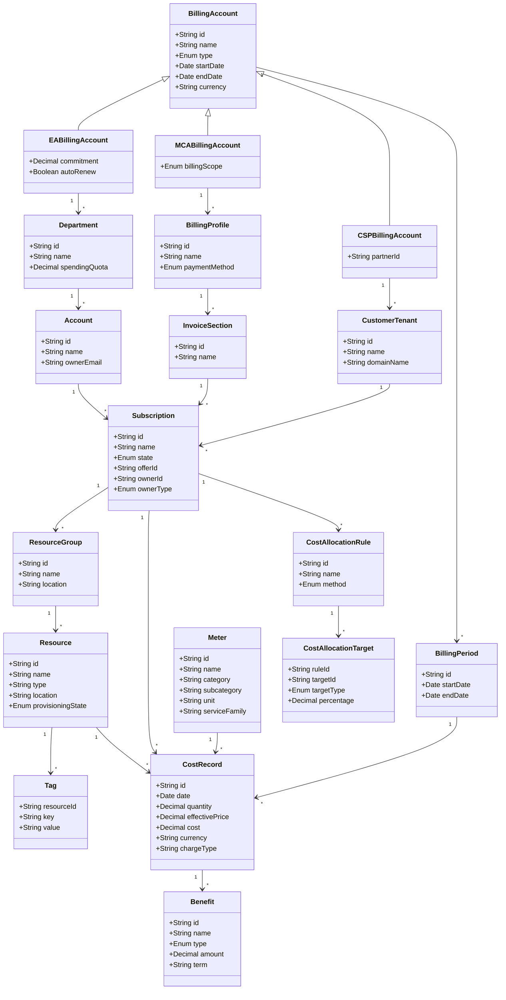

# GCP Billing Data Ontology                              
                     
                     

                       
```pseudocode                     
// Core Billing Entities
Class BillingAccount {
    id: String [PK, format: GUID or Agreement ID]
    name: String
    type: Enum [EA, MCA, CSP]
    startDate: Date
    endDate: Date
    currency: String
    
    // Relationships
    if type == EA:
        hasMany: Department
    if type == MCA:
        hasMany: BillingProfile
    if type == CSP:
        hasMany: CustomerTenant
    
    // Constraints
    - Must have at least one child entity
    - startDate must be before endDate
}

Class BillingProfile {  // MCA only
    id: String [PK]
    name: String
    billingAccountId: String [FK]
    
    // Relationships
    belongsTo: BillingAccount
    hasMany: InvoiceSection
    
    // Constraints
    - Can only exist under MCA billing accounts
}

Class InvoiceSection {  // MCA only
    id: String [PK]
    name: String
    billingProfileId: String [FK]
    
    // Relationships
    belongsTo: BillingProfile
    hasMany: Subscription
    
    // Constraints
    - Can only exist under MCA billing profiles
}

Class Department {  // EA only
    id: String [PK]
    name: String
    billingAccountId: String [FK]
    spendingQuota: Decimal [optional]
    
    // Relationships
    belongsTo: BillingAccount
    hasMany: Account
    
    // Constraints
    - Can only exist under EA billing accounts
}

Class Account {  // EA only
    id: String [PK]
    name: String
    departmentId: String [FK, optional]
    ownerEmail: String
    
    // Relationships
    belongsTo: Department [optional]
    belongsTo: BillingAccount
    hasMany: Subscription
    
    // Constraints
    - Can only exist under EA billing accounts
    - Can be unassigned (no department)
}

Class CustomerTenant {  // CSP only
    id: String [PK]
    name: String
    billingAccountId: String [FK]
    
    // Relationships
    belongsTo: BillingAccount
    hasMany: Subscription
    
    // Constraints
    - Can only exist under CSP billing accounts
}

Class Subscription {
    id: String [PK, format: GUID]
    name: String
    state: Enum [Active, Disabled, Deleted, etc.]
    offerId: String  // MS-AZR-0017P, etc.
    
    // Polymorphic relationship based on billing model
    ownerId: String [FK] // Points to Account (EA), InvoiceSection (MCA), or CustomerTenant (CSP)
    ownerType: Enum [EA_Account, MCA_InvoiceSection, CSP_CustomerTenant]
    
    // Relationships
    belongsTo: Account OR InvoiceSection OR CustomerTenant
    hasMany: ResourceGroup
    hasMany: CostRecord
    
    // Constraints
    - Must have valid ownerType matching appropriate entity
    - Active subscriptions must have valid payment method
}

Class ResourceGroup {
    id: String [PK]
    name: String
    subscriptionId: String [FK]
    location: String
    
    // Relationships
    belongsTo: Subscription
    hasMany: Resource
    
    // Constraints
    - name must be unique within a subscription
    - name must be 1-90 characters
}

Class Resource {
    id: String [PK]
    name: String
    resourceGroupId: String [FK]
    type: String // Microsoft.Compute/virtualMachines, etc.
    location: String
    provisioningState: Enum [Succeeded, Failed, etc.]
    
    // Relationships
    belongsTo: ResourceGroup
    hasMany: Tag
    hasMany: CostRecord
    
    // Constraints
    - name constraints vary by resource type
    - location must be valid Azure region
}

Class Tag {
    resourceId: String [PK, FK]
    key: String [PK]
    value: String
    
    // Relationships
    belongsTo: Resource
    
    // Constraints
    - key limited to 512 characters
    - value limited to 256 characters
    - maximum 50 tags per resource
    - no spaces in keys
}

Class CostRecord {
    id: String [PK]
    date: Date
    subscriptionId: String [FK]
    resourceId: String [FK, optional]
    quantity: Decimal
    effectivePrice: Decimal
    cost: Decimal
    currency: String
    meterId: String [FK]
    
    // Relationships
    belongsTo: Subscription
    belongsTo: Resource [optional]
    belongsTo: Meter
    belongsTo: BillingPeriod
    hasMany: Benefit [optional]
    
    // Constraints
    - cost should equal quantity * effectivePrice (±rounding)
    - date must be within billing period
}

Class Meter {
    id: String [PK]
    name: String
    category: String
    subcategory: String
    unit: String
    serviceFamily: String
    
    // Relationships
    hasMany: CostRecord
    
    // Constraints
    - Valid unit must match service specifications
}

Class Benefit {
    id: String [PK]
    name: String
    type: Enum [ReservedInstance, SavingsPlan, HybridBenefit]
    costRecordId: String [FK]
    amount: Decimal  // Negative value representing the discount
    term: String [optional] // P1Y, P3Y
    
    // Relationships
    belongsTo: CostRecord
    
    // Constraints
    - amount must be <= 0 (representing discount)
    - term required for RI and Savings Plan
}

Class CostAllocationRule {
    id: String [PK]
    name: String
    method: Enum [Proportional, Fixed, EvenSplit]
    sourceSubscriptionId: String [FK]
    
    // Relationships
    belongsTo: Subscription (source)
    hasMany: CostAllocationTarget
    
    // Constraints
    - Rules must have at least one target
    - Source and targets cannot be the same
}

Class CostAllocationTarget {
    ruleId: String [PK, FK]
    targetId: String [PK]  // Target resource or subscription
    targetType: Enum [Subscription, ResourceGroup, Resource]
    percentage: Decimal [required if rule method == Fixed]
    
    // Relationships
    belongsTo: CostAllocationRule
    
    // Constraints
    - If rule method is Fixed, sum of all target percentages must equal 100%
    - Valid targetType with matching targetId
}

Class BillingPeriod {
    id: String [PK]
    startDate: Date
    endDate: Date
    billingAccountId: String [FK]
    
    // Relationships
    belongsTo: BillingAccount
    hasMany: CostRecord
    
    // Constraints
    - startDate must be before endDate
    - No overlapping billing periods for same billing account
}

// Rules
1. Resources with tag "auto-shutdown: true" should only have costs during business hours
2. Resources deleted mid-month should have costs only until deletion date
3. Reserved instances always belong to a specific subscription but can be shared
4. Hybrid Benefit discounts should only apply to eligible resource types (Windows VMs, SQL)
5. Cost allocation rules cannot be circular (A→B→C→A)
6. Resources must exist in registered resource providers for the subscription
7. Trial subscriptions have spending limits that cannot be exceeded
8. EA monetary commitments must be consumed within the agreement term                  
```