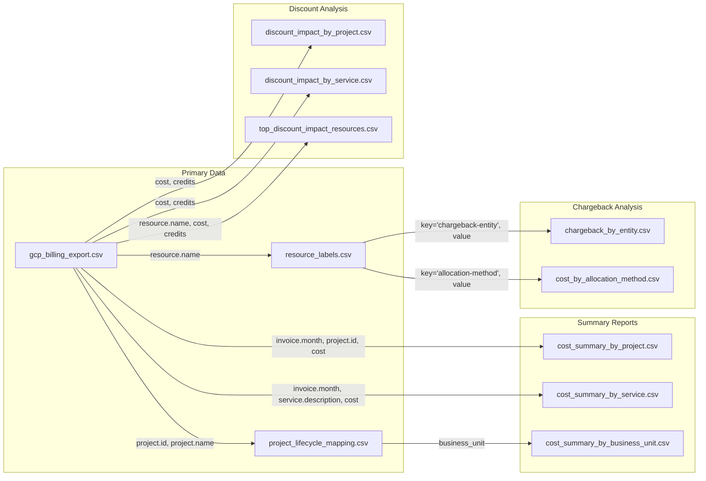

# GCP Billing Data Dictionary          
          
## Table of Contents          
- [Introduction](#introduction)          
- [Main Billing Schema](#main-billing-schema)          
- [Complex Fields in Detail](#complex-fields-in-detail)          
- [Generated Files Reference](#generated-files-reference)          
- [Cloud Provider Comparison](#cloud-provider-comparison)          
- [Chargeback and Showback Implementation](#chargeback-and-showback-implementation)          
- [GCP-Specific Concepts](#gcp-specific-concepts)          
- [Multi-Cloud FinOps Strategies](#multi-cloud-finops-strategies)          
          
---          
          
## Introduction          
          
This document serves as a comprehensive reference for GCP billing data generated by the simulation tool. The data follows Google Cloud's standard billing export format to BigQuery, enabling realistic analysis for cost management, FinOps practices, and chargeback modeling.          
          
### Purpose and Use Cases          
          
This simulated billing data supports several key use cases:          
- Cloud cost analysis and optimization          
- Chargeback and showback implementation          
- Budget planning and forecasting          
- Multi-cloud cost comparison          
- FinOps maturity development          
          
### Data Structure Overview          
          
The data follows Google Cloud's hierarchical billing model with:          
- Organization-level structure          
- Project-based billing          
- Resource-level cost attribution          
- Label-based cost allocation          
- Tiered pricing representation          
- Credit and discount application          
          
---          
          
## Main Billing Schema          
          
The primary billing data is contained in `gcp_billing_export.csv` with the following schema:          
          
### Core Billing Information          
          
| Field Name | Data Type | Description | Example |          
|------------|-----------|-------------|---------|          
| `billing_account_id` | STRING | Billing account identifier | `01A2B3-C4D5E6-F7G8H9` |          
| `cost` | FLOAT | Cost for the usage | `1.25` |          
| `currency` | STRING | Currency of the cost | `USD` |          
| `currency_conversion_rate` | FLOAT | Conversion rate if applicable | `1.0` |          
| `invoice.month` | STRING | Invoice month (YYYY-MM) | `2023-06` |          
| `cost_type` | STRING | Type of cost | `regular` |          
| `export_time` | TIMESTAMP | When data was exported | `2023-06-02T02:15:00Z` |          
          
### Service and SKU Information          
          
| Field Name | Data Type | Description | Example |          
|------------|-----------|-------------|---------|          
| `service.id` | STRING | Service identifier | `computeengine` |          
| `service.description` | STRING | Human-readable service name | `Compute Engine` |          
| `sku.id` | STRING | SKU identifier | `8C93-B842-361A` |          
| `sku.description` | STRING | Human-readable SKU description | `Compute Engine Instance N2 Running in Americas` |          
          
### Project Information          
          
| Field Name | Data Type | Description | Example |          
|------------|-----------|-------------|---------|          
| `project.id` | STRING | Project identifier | `aviation-prod-444401` |          
| `project.number` | STRING | Numeric project identifier | `444400000001` |          
| `project.name` | STRING | Human-readable project name | `Aviation Production` |          
| `project.ancestry_numbers` | STRING | Hierarchical path | `organizations/12345678901/folders/87654321098` |          
| `project.labels` | JSON | User-defined project labels | `{"environment":"production"}` |          
          
### Resource Information          
          
| Field Name | Data Type | Description | Example |          
|------------|-----------|-------------|---------|          
| `resource.name` | STRING | Resource name | `prod-web-db-m-a1b2` |          
| `resource.global_name` | STRING | Fully qualified resource name | `//cloudresourcemanager.googleapis.com/projects/aviation-prod-444401/services/computeengine/resources/prod-web-db-m-a1b2` |          
| `system_labels` | JSON | System-generated resource labels | See Complex Fields section |          
          
### Location Information          
          
| Field Name | Data Type | Description | Example |          
|------------|-----------|-------------|---------|          
| `location.location` | STRING | Resource location | `us-central1` |          
| `location.country` | STRING | Country component | `US` |          
| `location.region` | STRING | Region component | `us-central1` |          
| `location.zone` | STRING | Zone component (if applicable) | `us-central1-a` |          
          
### Usage Information          
          
| Field Name | Data Type | Description | Example |          
|------------|-----------|-------------|---------|          
| `usage_start_time` | TIMESTAMP | Start of usage period | `2023-06-01T12:00:00Z` |          
| `usage_end_time` | TIMESTAMP | End of usage period | `2023-06-01T13:00:00Z` |          
| `usage.amount` | FLOAT | Quantity used | `2.5` |          
| `usage.unit` | STRING | Unit of measure | `GiB-month` |          
| `usage.amount_in_pricing_units` | FLOAT | Amount in pricing units | `2.5` |          
| `usage.pricing_unit` | STRING | Pricing unit | `GiB-month` |          
          
### Pricing Information          
          
| Field Name | Data Type | Description | Example |          
|------------|-----------|-------------|---------|          
| `price.effective_price` | FLOAT | Effective unit price | `0.0638` |          
| `price.tier` | STRING | Price tier | `Standard` |          
| `price.tiered_rates` | JSON | Tiered pricing structure | See Complex Fields section |          
          
### Credit and Adjustment Information          
          
| Field Name | Data Type | Description | Example |          
|------------|-----------|-------------|---------|          
| `credits` | JSON | Credits applied to usage | See Complex Fields section |          
| `adjustment_info.id` | STRING | Adjustment identifier | `adj-a1b2c3d4` |          
| `adjustment_info.description` | STRING | Adjustment description | `USAGE_CORRECTION for CloudStorage usage in us-central1` |          
| `adjustment_info.mode` | STRING | Adjustment mode | `USAGE_CORRECTION` |          
          
---          
          
## Complex Fields in Detail          
          
Several fields in the schema contain complex structured data in JSON format:          
          
### `credits` (JSON Array)          
          
Contains detailed information about discounts and credits applied to the usage.          
          
```json          
[          
  {          
    "name": "Committed Use Discount",          
    "full_name": "Committed Use Discount: 1 year",          
    "type": "cud-1yr",          
    "id": "cud-1yr-a1b2c3d4",          
    "amount": -2.50          
  }          
]          
```          
          
| Sub-field | Description |          
|-----------|-------------|          
| `name` | Short name for the credit |          
| `full_name` | Complete description |          
| `type` | Credit type identifier |          
| `id` | Unique identifier |          
| `amount` | Credit amount (negative value) |          
          
### `project.labels` (JSON Object)          
          
User-defined key-value pairs associated with the project.          
          
```json          
{          
  "environment": "production",          
  "cost-center": "aviation-1234",          
  "team": "platform",          
  "business-unit": "aviation"          
}          
```          
          
Common project label keys include:          
- `environment`: Deployment environment (production, development, etc.)          
- `cost-center`: Financial tracking identifier          
- `team`: Responsible team          
- `business-unit`: Organizational unit          
- `application`: Application identifier          
- `project`: Project name          
          
### `system_labels` (JSON Object)          
          
System-generated labels for the resource, varying by service type.          
          
```json          
{          
  "compute.googleapis.com/resource_id": "9876543210",          
  "compute.googleapis.com/resource_name": "prod-web-db-m-a1b2",          
  "compute.googleapis.com/machine_type": "n2-standard-4",          
  "compute.googleapis.com/zone": "us-central1-a",          
  "compute.googleapis.com/network": "projects/aviation-prod-444401/global/networks/default",          
  "compute.googleapis.com/subnet": "projects/aviation-prod-444401/regions/us-central1/subnetworks/default",          
  "goog-resource-family": "computeengine",          
  "goog-creation-time": "2023-01-15T08:30:45Z"          
}          
```          
          
Common system labels include:          
- Resource identifiers          
- Resource configuration details          
- Creation timestamps          
- Service-specific attributes          
- Network information          
          
### `price.tiered_rates` (JSON Array)          
          
Detailed information about tiered pricing structure with each element representing a pricing tier.          
          
```json          
[          
  {          
    "start_usage_amount": "0",          
    "end_usage_amount": "730",          
    "unit_price": 0.0638,          
    "unit": "hour"          
  },          
  {          
    "start_usage_amount": "730",          
    "end_usage_amount": null,          
    "unit_price": 0.04466,          
    "unit": "hour"          
  }          
]          
```          
          
| Sub-field | Description |          
|-----------|-------------|          
| `start_usage_amount` | Tier starting amount |          
| `end_usage_amount` | Tier ending amount (null = unlimited) |          
| `unit_price` | Price per unit in this tier |          
| `unit` | Unit of measure |          
          
---          
          
## Generated Files Reference          
          
The data generator creates multiple output files for comprehensive analysis:          
          
### Primary Data Files          
          
| File Name | Description | Primary Keys | Key Fields |          
|-----------|-------------|--------------|------------|          
| `gcp_billing_export.csv` | Main billing data export | `billing_account_id`, `project.id`, `resource.name` | All billing fields described above |          
| `resource_labels.csv` | Resource-level labels | `resource_name`, `key` | `resource_name`, `key`, `value` |          
| `project_lifecycle_mapping.csv` | Project metadata | `project_name` | `project_name`, `lifecycle`, `business_unit`, `use_case` |          
          
### Analysis and Summary Files          
          
| File Category | Files | Purpose |          
|---------------|-------|---------|          
| **Cost Summaries** | `cost_summary_by_project.csv`<br>`cost_summary_by_service.csv`<br>`cost_summary_by_business_unit.csv` | Aggregated cost data by different dimensions |          
| **Chargeback Reports** | `chargeback_by_entity.csv`<br>`chargeback_by_service_entity.csv`<br>`cost_by_allocation_method.csv` | Cost allocation and chargeback analysis |          
| **Discount Analysis** | `discount_impact_by_project.csv`<br>`discount_impact_by_service.csv`<br>`top_discount_impact_resources.csv`<br>`discount_impact_summary.json` | Analysis of discounts and their impact |          
          
### Data Relationships          
          
The files are interconnected through these key relationships:    


	
          
1. **Resource Identification Chain**:          
   - `resource.name` in main billing data links to `resource_name` in labels          
   - Labels provide cost allocation attributes          
          
2. **Project Hierarchy**:          
   - `project.id` and `project.name` link to project metadata          
   - Project metadata provides business context (lifecycle, business unit)          
          
3. **Cost Allocation Flow**:          
   - Labels determine chargeback entities          
   - Chargeback reports show resulting allocations          
          
### Key Analysis Paths          
          
1. **Cost Breakdown Analysis**:          
   - Start with cost summaries by project/service/business unit          
   - Drill down to detailed records in main billing data          
   - Analyze by labels for custom dimensions          
          
2. **Chargeback Implementation**:          
   - Review allocation methods in `cost_by_allocation_method.csv`          
   - Check entity assignments in `chargeback_by_entity.csv`          
   - For service details by entity, use `chargeback_by_service_entity.csv`          
          
3. **Discount Optimization**:          
   - Find heavily discounted services in `discount_impact_by_service.csv`          
   - Review project discount effectiveness in `discount_impact_by_project.csv`          
   - Identify specific resources with large discounts in `top_discount_impact_resources.csv`          
          
---          
          
## Cloud Provider Comparison          
          
### Billing Structure Differences          
          
| Aspect | Google Cloud (GCP) | Amazon Web Services (AWS) | Microsoft Azure |          
|--------|--------------------|-----------------------------|-----------------|          
| **Primary Billing Unit** | Projects | Accounts | Subscriptions |          
| **Billing Data Format** | BigQuery tables with nested JSON | CSV with flat structure (CUR) | JSON or CSV exports |          
| **Billing Data Granularity** | Resource-level | Resource-level | Resource/meter-level |          
| **Billing Schema** | Hierarchical with nested fields | Flat structure with many columns | Resource-centric structure |          
| **Unique Fields** | `project.ancestry_numbers`, `system_labels` | `lineItem/LineItemType`, `savingsPlan/` | `meterDetails`, `reservationId` |          
          
### Resource Hierarchy Comparison          
          
| Aspect | Google Cloud (GCP) | Amazon Web Services (AWS) | Microsoft Azure |          
|--------|--------------------|-----------------------------|-----------------|          
| **Hierarchy Levels** | Organization → Folders → Projects → Resources | Organization → OUs → Accounts → Resources | Tenant → Management Groups → Subscriptions → Resource Groups → Resources |          
| **Folder/Grouping Levels** | Multiple nested folders allowed | Limited to 5 OU levels | Multiple nested management groups |          
| **Resource Ownership** | Resources belong to projects | Resources belong to accounts | Resources belong to resource groups in subscriptions |          
| **Billing Association** | Billing accounts linked to projects | Master payer account with linked accounts | Billing accounts linked to subscriptions |          
          
### Discount Mechanism Comparison          
          
| Aspect | Google Cloud (GCP) | Amazon Web Services (AWS) | Microsoft Azure |          
|--------|--------------------|-----------------------------|-----------------|          
| **Commitment Discounts** | Committed Use Discounts (CUDs) | Reserved Instances (RIs), Savings Plans | Reserved Instances (RIs), Azure Savings Plan |          
| **Usage-Based Discounts** | Sustained Use Discounts | None | None |          
| **Discount Representation** | `credits` array with detailed structure | `reservation/` and `savingsPlan/` columns | Applied directly to `cost` |          
| **Discount Transferability** | CUDs apply within project | RIs can be shared within organization | RIs can be shared within scope |          
          
### Cost Allocation Comparison          
          
| Aspect | Google Cloud (GCP) | Amazon Web Services (AWS) | Microsoft Azure |          
|--------|--------------------|-----------------------------|-----------------|          
| **Tagging Mechanism** | Labels (key-value pairs) | Tags (key-value pairs) | Tags (key-value pairs) |          
| **Tag/Label Limitations** | 64 labels per resource, key ≤ 63 chars, value ≤ 63 chars | 50 user tags per resource, case-sensitive | 50 tags per resource, case-insensitive |          
| **Cost Allocation Tags** | All labels used for billing | Must activate cost allocation tags | All tags used for billing |          
| **Tag Representation** | Nested JSON in `project.labels` | Tag columns in CUR | Tags in resource details |          
          
### FinOps Tool Comparison          
          
| Aspect | Google Cloud (GCP) | Amazon Web Services (AWS) | Microsoft Azure |          
|--------|--------------------|-----------------------------|-----------------|          
| **Built-in Cost Analysis** | BigQuery + Data Studio integration | Cost Explorer, Budgets | Cost Management, Advisor |          
| **Anomaly Detection** | Budget alerts, custom with BigQuery | AWS Cost Anomaly Detection | Azure Cost Management alerts |          
| **Forecasting Capabilities** | Custom with BigQuery | Built into Cost Explorer | Built into Cost Management |          
| **Resource Optimization** | Recommender | Compute Optimizer, Trusted Advisor | Azure Advisor |          
          
---          
          
## Chargeback and Showback Implementation          
          
### Chargeback Models by Cloud Provider          
          
| Aspect | Google Cloud (GCP) | Amazon Web Services (AWS) | Microsoft Azure |          
|--------|--------------------|-----------------------------|-----------------|          
| **Primary Chargeback Unit** | Projects with labels | Accounts with tags | Subscriptions/resource groups with tags |          
| **Hierarchical Chargeback** | Folder-based roll-ups | Organizational Unit roll-ups | Management Group roll-ups |          
| **Native Chargeback Tools** | Limited - relies on BigQuery | AWS Cost Categories | Cost Management cost allocation |          
| **Implementation Complexity** | Medium - requires BigQuery skills | Medium - requires CUR analysis | Lower with built-in tools |          
          
### Showback Implementation by Cloud Provider          
          
| Aspect | Google Cloud (GCP) | Amazon Web Services (AWS) | Microsoft Azure |          
|--------|--------------------|-----------------------------|-----------------|          
| **Native Visualization** | Data Studio on BigQuery | QuickSight on CUR | Power BI integration |          
| **Cost Visibility Hierarchy** | Organization → Folder → Project | Organization → OU → Account | Tenant → Management Group → Subscription |          
| **Built-in Dashboards** | Limited in Billing Console | AWS Cost Explorer | Azure Cost Management |          
| **Role-Based Access** | Project-level IAM | Account-level IAM | RBAC with scoped access |          
          
### Common Chargeback Models          
          
| Model | Description | Best For | Implementation Approach |          
|-------|-------------|----------|------------------------|          
| **Direct Allocation** | Costs assigned directly to consuming teams | Clear resource ownership | Use labels/tags to identify owners |          
| **Proportional Allocation** | Shared costs distributed based on usage | Shared services | Calculate usage percentage and distribute costs |          
| **Equal Distribution** | Shared costs split equally | Central services with equal benefit | Divide total cost by number of consumers |          
| **Tiered Allocation** | Different rates based on consumption | Volume-based pricing | Create tiers and apply different rates per tier |          
          
### Chargeback Implementation Considerations          
          
| Consideration | Description | GCP Approach |          
|---------------|-------------|-------------|          
| **Shared Resource Allocation** | How to divide costs for shared resources | Use project labels for allocation percentages |          
| **Internal Transfer Pricing** | Applying markups or custom rates | Implement in post-processing via BigQuery |          
| **Custom Rates Application** | Overriding cloud provider rates | Post-process billing data with custom rates |          
| **Non-Cloud Cost Integration** | Including non-cloud costs in chargeback | Join with external cost data in BigQuery |          
| **RI/CUD Benefit Allocation** | How to distribute commitment discounts | Allocate at project level with custom logic |          
          
---          
          
## GCP-Specific Concepts          
          
### Unique GCP Billing Fields          
          
| Field | Description | Usage in Analysis |          
|-------|-------------|-------------------|          
| `project.ancestry_numbers` | Complete path from organization to project | Organizational hierarchy analysis |          
| `system_labels` | Service-specific metadata | Resource configuration analysis |          
| `price.tiered_rates` | Explicit tiered pricing documentation | "What-if" pricing analysis |          
| `credits` array | Detailed discount attribution | Discount optimization |          
          
### GCP-Specific Pricing Models          
          
| Model | Description | Representation in Data |          
|-------|-------------|------------------------|          
| **Resource-Based Pricing** | Charges based on allocated resources | Specific SKUs for each resource dimension |          
| **Sustained Use Discounts** | Automatic discounts for long-running VMs | Credits with type `sustained-use-discount` |          
| **Committed Use Discounts** | Discounts for committed resource usage | Credits with type `cud-1yr` or `cud-3yr` |          
| **Free Tier** | No-cost usage within limits | Credits that offset regular costs |          
| **Preemptible VMs** | Low-cost ephemeral instances | Specific SKUs for preemptible instances |          
          
### GCP Billing Hierarchy          
          
GCP's resource hierarchy affects how billing data is structured:          
          
```          
Organization          
  └── Folders (can be nested)          
       └── Projects (billing unit)          
            └── Resources (cost generators)          
```          
          
Key aspects:          
- Billing accounts are linked to projects          
- Projects can be organized in folders          
- Resources belong to exactly one project          
- Labels can be applied at both project and resource level          
          
### GCP Credit Types          
          
| Credit Type | Description | Example in Data |          
|-------------|-------------|-----------------|          
| `sustained-use-discount` | Automatic discounts for VMs running most of the month | `{"type": "sustained-use-discount", "amount": -12.50}` |          
| `cud-1yr` | 1-year committed use discount | `{"type": "cud-1yr", "amount": -25.75}` |          
| `cud-3yr` | 3-year committed use discount | `{"type": "cud-3yr", "amount": -42.30}` |          
| `free-tier` | Free tier usage credit | `{"type": "free-tier", "amount": -5.00}` |          
| `promotional-credit` | Marketing or promotional credit | `{"type": "promotional-credit", "amount": -10.00}` |          
| `spend-based-commitment` | Volume discount credit | `{"type": "spend-based-commitment", "amount": -15.50}` |          
          
---          
          
## Multi-Cloud FinOps Strategies          
          
### Data Normalization Approach          
          
To effectively manage costs across multiple cloud providers:          
          
1. **Create Unified Dimensions**          
   - Map GCP Projects = AWS Accounts = Azure Subscriptions          
   - Standardize tag/label keys across clouds          
   - Establish common business unit and cost center definitions          
          
2. **Normalize Service Categories**          
   - Create a unified service taxonomy          
   - Map provider-specific services to common categories          
   - Standardize units of measure where possible          
          
3. **Harmonize Resource Hierarchy**          
   - Create a common organizational structure          
   - Map cloud-specific hierarchies to this structure          
   - Implement consistent tagging across providers          
          
### Unified Chargeback Strategy          
          
For consistent chargeback across cloud platforms:          
          
1. **Define Standard Allocation Rules**          
   - Create provider-agnostic allocation policies          
   - Implement consistent tagging requirements          
   - Document allocation method for each shared service          
          
2. **Build a Central Cost Database**          
   - Import billing data from all providers          
   - Normalize fields to a common schema          
   - Apply standard allocation logic          
          
3. **Provide Unified Reporting**          
   - Create reports that span providers          
   - Show costs by business dimension, not cloud provider          
   - Ensure consistent time periods and currencies          
          
### Cloud-Specific Optimization          
          
Leverage each provider's strengths:          
          
1. **GCP Optimization Focus**          
   - Resource-based right-sizing (CPU, memory, storage)          
   - Sustained use discount maximization          
   - BigQuery for deep cost analysis          
          
2. **AWS Optimization Focus**          
   - Savings Plans and Reserved Instance management          
   - Instance right-sizing with Compute Optimizer          
   - Leverage Cost Explorer anomaly detection          
          
3. **Azure Optimization Focus**          
   - Azure Hybrid Benefit utilization          
   - Reserved Instance optimization          
   - Cost Management recommendations          
          
---          
          
## Appendix: Schema Reference Quick Guide          
          
### Most Used Billing Fields          
          
| Field | Description | Example |          
|-------|-------------|---------|          
| `billing_account_id` | Billing account | `01A2B3-C4D5E6-F7G8H9` |          
| `service.description` | Service name | `Compute Engine` |          
| `project.id` | Project identifier | `aviation-prod-444401` |          
| `project.name` | Project name | `Aviation Production` |          
| `location.region` | Region | `us-central1` |          
| `usage.amount` | Usage quantity | `2.5` |          
| `cost` | Cost amount | `1.25` |          
| `invoice.month` | Invoice month | `2023-06` |          
          
### Label and Tag Fields          
          
| Field Type | Field | Description |          
|------------|-------|-------------|          
| **Project Labels** | `project.labels` | JSON object with user-defined project labels |          
| **Resource Labels** | Fields in `resource_labels.csv` | Key-value pairs for resources |          
| **System Labels** | `system_labels` | System-generated label data |          
          
### Dimension Hierarchy for Analysis          
          
1. **Time Dimensions**          
   - Invoice Month          
   - Usage Date (Start/End)          
          
2. **Organizational Dimensions**          
   - Organization          
   - Folder          
   - Project          
   - Resource          
          
3. **Technical Dimensions**          
   - Service          
   - Location          
   - SKU          
          
4. **Financial Dimensions**          
   - Billing Account          
   - Cost          
   - Credits          
          
### Common Queries and Analysis          
          
1. **Monthly Trend Analysis**          
   - Group by `invoice.month`          
   - Sum `cost`          
          
2. **Service Cost Breakdown**          
   - Group by `service.description`          
   - Sum `cost`          
          
3. **Project Comparison**          
   - Group by `project.name`          
   - Sum `cost`          
          
4. **Discount Analysis**          
   - Parse `credits` field          
   - Group by credit type          
   - Sum credit amounts