# GCP Billing Data Ontology                              

```mermaid                    
classDiagram          
    Organization "1" -- "n" BillingAccount : has          
    Organization "1" -- "n" Folder : contains          
    Organization "1" -- "n" Project : contains          
    Folder "1" -- "n" Folder : contains          
    Folder "1" -- "n" Project : contains          
    BillingAccount "1" -- "n" Project : funds          
    BillingAccount "1" -- "n" Invoice : generates          
    Project "1" -- "n" Resource : contains          
    Project "1" -- "n" ProjectService : enables          
    ProjectService "n" -- "1" Service : references          
    Service "1" -- "n" SKU : offers          
    SKU "1" -- "n" TieredRate : priced by          
    SKU "1" -- "n" UsageRecord : tracked as          
    Resource "1" -- "n" UsageRecord : generates          
    UsageRecord "1" -- "n" Credit : receives          
    Invoice "1" -- "n" InvoiceItem : itemizes          
    InvoiceItem "n" -- "1" Project : charged to          
    InvoiceItem "n" -- "1" Service : for          
    InvoiceItem "n" -- "1" SKU : for specific          
          
    class Organization {          
        +string organizationId          
        +string displayName          
        +OrganizationState state          
    }          
              
    class Folder {          
        +string folderId          
        +string displayName          
        +string parentId          
        +FolderState state          
    }          
              
    class BillingAccount {          
        +string billingAccountId          
        +string displayName          
        +boolean open          
        +BillingAccountState state          
    }          
              
    class Project {          
        +string projectId          
        +string projectNumber          
        +string displayName          
        +string parentId          
        +string billingAccountId          
        +Map~string,string~ labels          
        +ProjectState state          
    }          
              
    class Service {          
        +string serviceId          
        +string displayName          
        +string category          
    }          
              
    class ProjectService {          
        +string projectId          
        +string serviceId          
        +boolean enabled          
    }          
              
    class SKU {          
        +string skuId          
        +string serviceId          
        +string displayName          
        +string description          
        +string region          
        +PricingModel pricingModel          
    }          
              
    class TieredRate {          
        +string tierId          
        +string skuId          
        +number startUsageAmount          
        +number endUsageAmount          
        +number unitPrice          
        +string unit          
    }          
              
    class Resource {          
        +string resourceId          
        +string resourceName          
        +string projectId          
        +string serviceId          
        +string location          
        +string zone          
        +Map~string,string~ labels          
        +Map~string,string~ systemLabels          
    }          
              
    class UsageRecord {          
        +string usageRecordId          
        +string resourceId          
        +string skuId          
        +datetime usageStartTime          
        +datetime usageEndTime          
        +number usageAmount          
        +string usageUnit          
        +number cost          
        +string currency          
        +CostType costType          
    }          
              
    class Credit {          
        +string creditId          
        +string usageRecordId          
        +string name          
        +CreditType type          
        +number amount          
    }          
              
    class Invoice {          
        +string invoiceId          
        +string billingAccountId          
        +string month          
        +date issueDate          
        +number totalAmount          
        +string currency          
        +InvoiceState state          
    }          
              
    class InvoiceItem {          
        +string invoiceItemId          
        +string invoiceId          
        +string projectId          
        +string serviceId          
        +string skuId          
        +string description          
        +number amount          
    }              
```                    
                     
                     

                       
```pseudocode                     
// Core Billing Entities                    
                    
Entity Organization {                    
    string organizationId [PK]                    
    string displayName                    
    date creationTime                    
    OrganizationState state                    
                        
    // Relationships                    
    hasMany Folder                    
    hasMany Project                    
    hasMany BillingAccount                    
                        
    // Rules                    
    Rule: An Organization must have at least one BillingAccount                    
    Rule: organizationId must match pattern "organizations/[0-9]+"                    
}                    
                    
Entity Folder {                    
    string folderId [PK]                    
    string displayName                    
    string parentId [FK: Organization.organizationId OR Folder.folderId]                    
    date creationTime                    
    FolderState state                    
                        
    // Relationships                    
    belongsTo Organization OR Folder                    
    hasMany Folder                    
    hasMany Project                    
                        
    // Rules                    
    Rule: folderId must match pattern "folders/[0-9]+"                    
    Rule: Folders can be nested up to 10 levels deep                    
}                    
                    
Entity BillingAccount {                    
    string billingAccountId [PK]                    
    string displayName                    
    boolean open                    
    BillingAccountState state                    
    string masterBillingAccount [FK, nullable]                    
                        
    // Relationships                    
    hasMany Project                    
    hasMany Invoice                    
    belongsTo Organization                    
                        
    // Rules                    
    Rule: billingAccountId must match pattern "[A-Z0-9]{6}-[A-Z0-9]{6}-[A-Z0-9]{6}"                    
    Rule: A closed BillingAccount cannot be assigned to new Projects                    
}                    
                    
Entity Project {                    
    string projectId [PK]                    
    string projectNumber [Unique]                    
    string displayName                    
    string parentId [FK: Organization.organizationId OR Folder.folderId]                    
    string billingAccountId [FK: BillingAccount.billingAccountId]                    
    date creationTime                    
    ProjectState state                    
    Map<string, string> labels                    
                        
    // Relationships                    
    belongsTo Organization OR Folder                    
    belongsTo BillingAccount                    
    hasMany Resource                    
    hasMany ProjectService                    
                        
    // Rules                    
    Rule: projectId must be globally unique                    
    Rule: projectId must be 6-30 characters, lowercase letters, numbers, and hyphens                    
    Rule: projectNumber is system-assigned and immutable                    
    Rule: Labels must follow GCP label constraints (63 char limit for keys/values)                    
    Rule: Maximum 64 labels per project                    
}                    
                    
Entity ProjectService {                    
    string projectId [FK: Project.projectId]                    
    string serviceId [FK: Service.serviceId]                    
    boolean enabled                    
                        
    // Composite PK                    
    PK: (projectId, serviceId)                    
                        
    // Relationships                    
    belongsTo Project                    
    belongsTo Service                    
                        
    // Rules                    
    Rule: A service can only be enabled once per project                    
}                    
                    
Entity Service {                    
    string serviceId [PK]                    
    string displayName                    
    string category                    
                        
    // Relationships                    
    hasMany SKU                    
                        
    // Rules                    
    Rule: serviceId must be globally unique                    
    Rule: serviceId must follow naming pattern "[a-z]+.googleapis.com"                    
}                    
                    
Entity SKU {                    
    string skuId [PK]                    
    string serviceId [FK: Service.serviceId]                    
    string displayName                    
    string description                    
    string region [nullable]                    
    PricingModel pricingModel                    
                        
    // Relationships                    
    belongsTo Service                    
    hasMany TieredRate                    
    hasMany UsageRecord                    
                        
    // Rules                    
    Rule: skuId must be globally unique                    
    Rule: skuId typically follows pattern "[A-Z0-9]{4}-[A-Z0-9]{4}-[A-Z0-9]{4}"                    
}                    
                    
Entity TieredRate {                    
    string tierId [PK]                    
    string skuId [FK: SKU.skuId]                    
    number startUsageAmount                    
    number endUsageAmount [nullable]                    
    number unitPrice                    
    string unit                    
                        
    // Relationships                    
    belongsTo SKU                    
                        
    // Rules                    
    Rule: startUsageAmount must be >= 0                    
    Rule: endUsageAmount must be > startUsageAmount if not null                    
    Rule: The ranges must not overlap for the same SKU                    
    Rule: unitPrice must be >= 0                    
}                    
                    
Entity Resource {                    
    string resourceId [PK]                    
    string resourceName                    
    string projectId [FK: Project.projectId]                    
    string serviceId [FK: Service.serviceId]                    
    string location                    
    string zone [nullable]                    
    date creationTime                    
    Map<string, string> labels                    
    Map<string, string> systemLabels                    
                        
    // Relationships                    
    belongsTo Project                    
    belongsTo Service                    
    hasMany UsageRecord                    
                        
    // Rules                    
    Rule: resourceId must be globally unique                    
    Rule: resourceName must follow service-specific naming requirements                    
    Rule: Labels must follow GCP label constraints (63 char limit for keys/values)                    
    Rule: Maximum 64 labels per resource                    
}                    
                    
Entity UsageRecord {                    
    string usageRecordId [PK]                    
    string resourceId [FK: Resource.resourceId]                    
    string skuId [FK: SKU.skuId]                    
    datetime usageStartTime                    
    datetime usageEndTime                    
    number usageAmount                    
    string usageUnit                    
    number usageAmountInPricingUnits                    
    string pricingUnit                    
    number cost                    
    string currency                    
    number currencyConversionRate                    
    CostType costType                    
                        
    // Relationships                    
    belongsTo Resource                    
    belongsTo SKU                    
    hasMany Credit                    
                        
    // Rules                    
    Rule: usageEndTime must be > usageStartTime                    
    Rule: usageAmount must be >= 0                    
    Rule: cost must be >= 0 for regular usage records                    
}                    
                    
Entity Credit {                    
    string creditId [PK]                    
    string usageRecordId [FK: UsageRecord.usageRecordId]                    
    string name                    
    string fullName                    
    CreditType type                    
    number amount                    
                        
    // Relationships                    
    belongsTo UsageRecord                    
                        
    // Rules                    
    Rule: amount must be <= 0 (credits are negative)                    
    Rule: amount cannot exceed the absolute cost of the associated usage record                    
}                    
                    
Entity Invoice {                    
    string invoiceId [PK]                    
    string billingAccountId [FK: BillingAccount.billingAccountId]                    
    string month [format: "YYYY-MM"]                    
    date issueDate                    
    date dueDate                    
    number totalAmount                    
    string currency                    
    InvoiceState state                    
                        
    // Relationships                    
    belongsTo BillingAccount                    
    hasMany InvoiceItem                    
                        
    // Rules                    
    Rule: invoiceId must follow pattern "^[A-Z0-9]+-[0-9]{8}$"                    
    Rule: month must be in format "YYYY-MM"                    
}                    
                    
Entity InvoiceItem {                    
    string invoiceItemId [PK]                    
    string invoiceId [FK: Invoice.invoiceId]                    
    string projectId [FK: Project.projectId]                    
    string serviceId [FK: Service.serviceId]                    
    string skuId [FK: SKU.skuId]                    
    string description                    
    number amount                    
                        
    // Relationships                    
    belongsTo Invoice                    
    belongsTo Project                    
    belongsTo Service                    
    belongsTo SKU                    
                        
    // Rules                    
    Rule: Sum of all InvoiceItem.amount must equal Invoice.totalAmount                    
}                    
                    
// Enumerations                    
                    
Enum OrganizationState {                    
    ACTIVE,                    
    DELETED                    
}                    
                    
Enum FolderState {                    
    ACTIVE,                    
    DELETED                    
}                    
                    
Enum BillingAccountState {                    
    ACTIVE,                    
    CLOSED,                    
    SUSPENDED                    
}                    
                    
Enum ProjectState {                    
    ACTIVE,                    
    DELETE_REQUESTED,                    
    DELETE_IN_PROGRESS,                    
    DELETED                    
}                    
                    
Enum PricingModel {                    
    ON_DEMAND,                    
    CONSUMPTION_BASED,                    
    TIERED,                    
    COMMITMENT,                    
    FREE_TIER                    
}                    
                    
Enum CostType {                    
    REGULAR,                    
    TAX,                    
    ADJUSTMENT,                    
    ROUNDING_ERROR                    
}                    
                    
Enum CreditType {                    
    SUSTAINED_USE_DISCOUNT,                    
    COMMITTED_USE_DISCOUNT_1YR,                    
    COMMITTED_USE_DISCOUNT_3YR,                    
    SPEND_BASED_COMMITMENT,                    
    FREE_TIER,                    
    PROMOTIONAL                    
}                    
                    
Enum InvoiceState {                    
    OPEN,                    
    PAID,                    
    VOID                    
}                    
                    
// Business Rules                    
                    
Rule ProjectHierarchy: "A Project can only belong to one parent (Organization or Folder)."                    
Rule BillingAccountAssignment: "A Project can only be associated with one BillingAccount at a time."                    
Rule CreditAllocation: "Credits cannot exceed the original cost amount."                    
Rule LabelNameFormat: "Label keys must match regex '[a-z0-9_-]{1,63}'."                    
Rule LabelValueFormat: "Label values must match regex '[a-z0-9_-]{0,63}'."                    
Rule RequiredLabels: "All resources should have at minimum environment, cost-center, and business-unit labels."                    
Rule ServiceEnablement: "A service must be enabled in a project before resources of that service can be created."                    
Rule ResourceOwnership: "Resources can only belong to one project."                    
Rule InvoicePeriod: "Invoice periods are calendar months."                    
Rule UsageTimeframe: "Usage records must fall within the billing period of their associated invoice."                    
Rule CreditTypes: "Credits are applied at the usage record level and must have a valid type."                    
Rule CurrencyConsistency: "All costs within a billing account must use consistent currency."                    
```